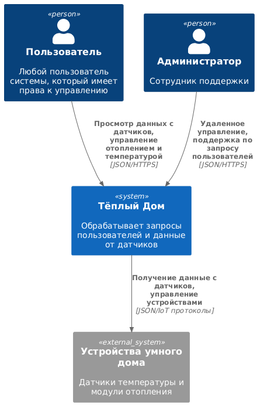
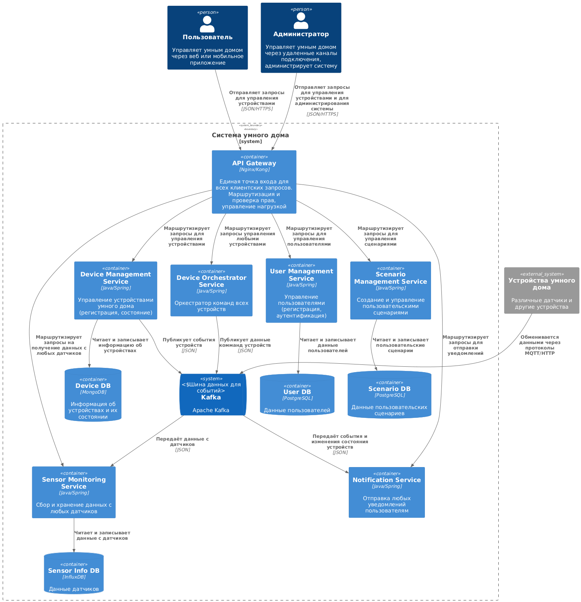
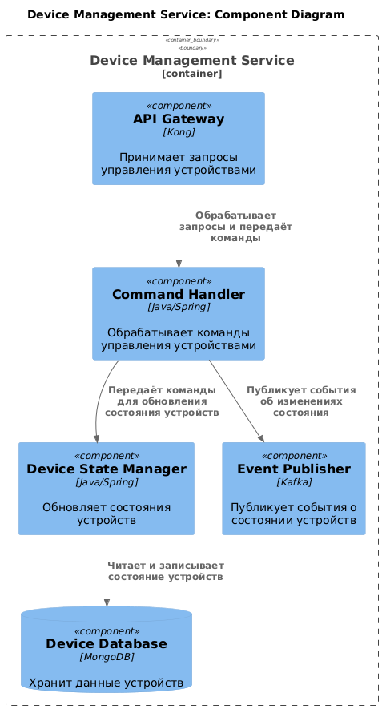
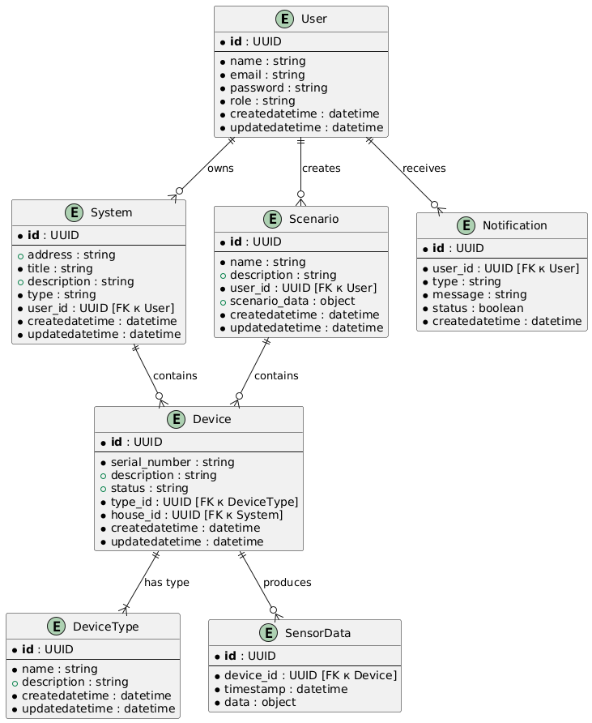

# Project_template

# Задание 1. Анализ и планирование

### 1. Описание функциональности монолитного приложения

**Управление отоплением:**

- Пользователи могут удалённо включать/выключать отопление в своих домах.
- Система получает данные о температуре с датчиков, установленных в домах.

**Мониторинг температуры:**

- Пользователи могут просматривать текущую температуру в своих домах через веб-интерфейс.
- Система получает данные о температуре с датчиков, установленных в домах.

### 2. Анализ архитектуры монолитного приложения

* Язык программирования: Java
* База данных: PostgreSQL
* Архитектура: Монолитная, все компоненты системы (обработка запросов, бизнес-логика, работа с данными) находятся в рамках одного приложения.
* Взаимодействие: Синхронное, запросы обрабатываются последовательно.
* Масштабируемость: Ограничена, так как монолит сложно масштабировать по частям.
* Развёртывание: Требует остановки всего приложения.

### 3. Определение доменов и границы контекстов

При данном способе построения процесса следующие домены и контексты:
1. Домен управления отоплением
   - Контекст снятия показаний
   - Контекст установки значений
2. Домен управления температурой
   - Контекст снятия показаний
   - Контекст установки значений

### **4. Проблемы монолитного решения**

- Данное решение тяжело расширяемо. При появление новых датчиков или при появлении новых функций в датчике потребуется снова и снова дорабатывать монолитное приложение.
- Трудно вести разработку параллельных датчиков (например несколько разных датчиков появляется в одно время)
- Трудно масштабировать нагрузку при неравномерной нагрузке на функционал разных датчиках (например отопление актуально в холодное время, температура актуальна круглый год)
- Из-за синхронного взаимодействия и последовательной обработки приложений могут быть проблемы при большой нагрузке. Также отказ любого из датчиков может приветси к отказ всей системы
- Из-за остановки всего приложения при развертывании - увеличивается время простоя приложения

### 5. Визуализация контекста системы — диаграмма С4



Ссылка на uml схему:
```markdown
./context-monolith-scheme.uml
```

# Задание 2. Проектирование микросервисной архитектуры

**Диаграмма контейнеров (Containers)**



Ссылка на uml схему:
```markdown
./container-diagram.uml
```

**Диаграмма компонентов (Components)**



Ссылка на uml схему:
```markdown
./component-diagram.uml
```

**Диаграмма кода (Code)**


# Задание 3. Разработка ER-диаграммы



Ссылка на uml схему:
```markdown
./er-diagram.uml
```

#  ❌ Задание 4. Создание и документирование API

### 1. Тип API

Укажите, какой тип API вы будете использовать для взаимодействия микросервисов. Объясните своё решение.

### 2. Документация API

Здесь приложите ссылки на документацию API для микросервисов, которые вы спроектировали в первой части проектной работы. Для документирования используйте Swagger/OpenAPI или AsyncAPI.